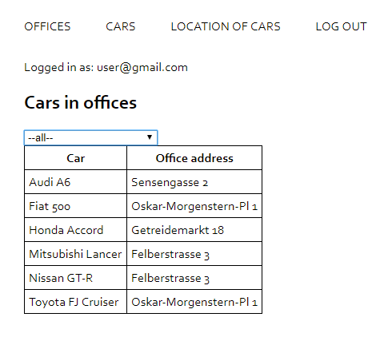

# Car rental web-site
A project done in Code Factory Vienna web development school for learning purposes.
## Screenshot

## Summary
This is a web-site based on PHP. Front-end is implemented in plain HTML. AJAX via JavaScript is used to update content. Data are stored in a mySQL database.
## Details
#### Page Sign in
A registered user can sign in. Only after log in the content of the web-site is available. On top of the page there is a link to sign up. The following credentials can be used to log in as administrator: admin@gmail.com and password 123456. Administrators can see additional page Report. After a user inputs credentials he is redirected to the page Locations of cars.
#### Page Sign up
A new user can fill in the form and register. Data is written into the mySQL database
#### Page Offices
All the offices are shown in a table
#### Page Cars
The page shows all the cars in the database
#### Location of cars
The page displays all the cars available for booking and in which office they are located. Filtering of officess is available via AJAX XMLHttpRequest using filter.js and filterOffice.php.
#### Page Report
Here one can see, how many cars are available for booking per each office.
#### Log out
A user can log out
